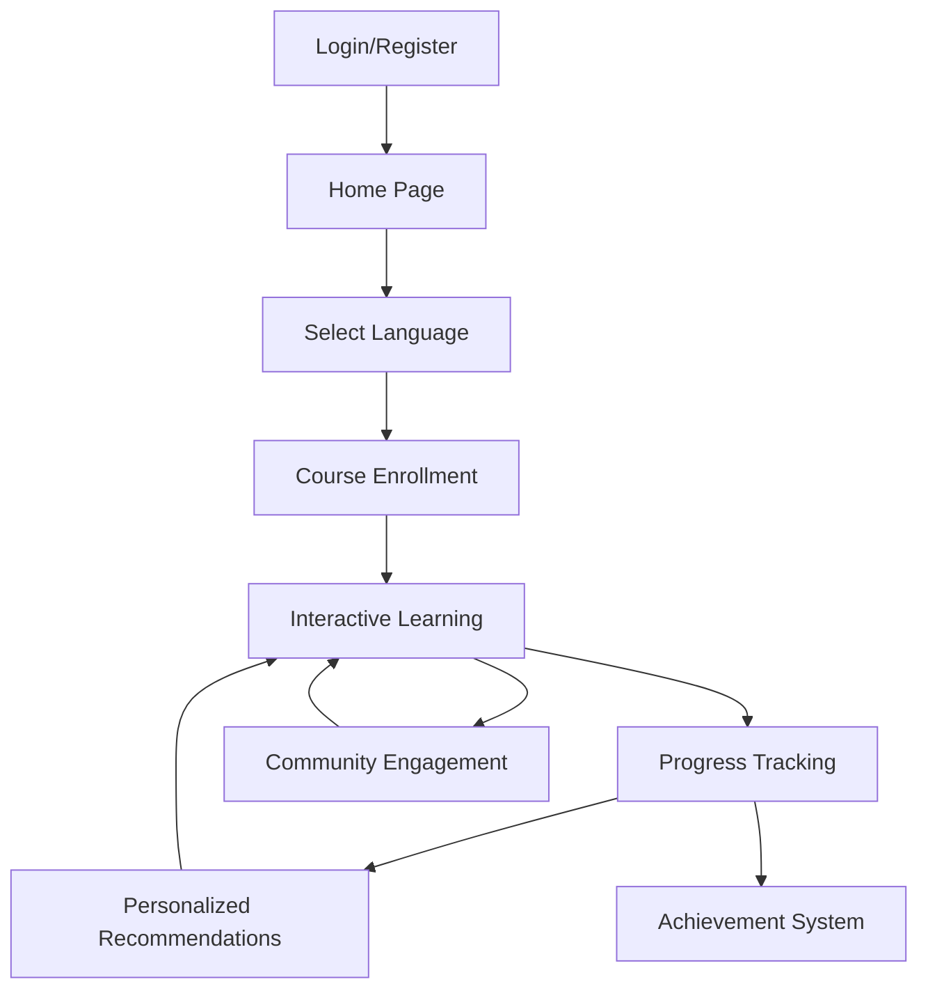

## 1. Product Overview
多语种在线教育平台，支持英语、日语、韩语等主流语言的沉浸式学习体验。
- 提供分级课程体系和互动式学习模块，帮助用户高效掌握语言技能
- 目标用户为语言学习者，市场价值在于提供个性化、系统化的语言学习解决方案

## 2. Core Features

### 2.1 User Roles
| Role | Registration Method | Core Permissions |
|------|---------------------|------------------|
| Normal User | Email/Third-party registration | Access all learning features, track progress, join community |
| Premium User | Subscription | Access advanced features, premium content, priority support |

### 2.2 Feature Module
1. **Home page**: Hero section, language selection, course recommendations, progress overview
2. **Course page**: Tiered courses, interactive learning modules, progress tracking
3. **Profile page**: Learning statistics, achievement system, personalized recommendations
4. **Community page**: Discussion forums, study groups, peer feedback
5. **Login/Register page**: User authentication, account management

### 2.3 Page Details
| Page Name | Module Name | Feature description |
|-----------|-------------|---------------------|
| Home page | Hero section | Language selection carousel, featured courses, learning progress summary |
| Home page | Course recommendations | Personalized course suggestions based on learning history and goals |
| Course page | Tiered courses | Beginner to advanced levels, structured learning paths for each language |
| Course page | Interactive modules | Vocabulary memorization, grammar exercises, speaking practice, listening training |
| Course page | Progress tracking | Real-time progress visualization, completion rates, skill level assessment |
| Profile page | Learning statistics | Detailed learning data, time spent, achievements unlocked |
| Profile page | Achievement system | Badges, levels, rewards for consistent learning and milestone completion |
| Community page | Discussion forums | Topic-based discussions, language exchange, peer support |
| Community page | Study groups | Create and join study groups for collaborative learning |
| Login/Register page | User authentication | Email/password login, third-party login options, account recovery |

## 3. Core Process
### Main User Flow
1. User registers/login to the platform
2. Selects target language(s) and proficiency level
3. Browses and enrolls in appropriate courses
4. Engages with interactive learning modules
5. Tracks learning progress and receives personalized recommendations
6. Participates in community activities and earns achievements

## 4. User Interface Design
### 4.1 Design Style
- Primary colors: #4361ee (blue), #3a0ca3 (purple)
- Secondary colors: #f72585 (pink), #4cc9f0 (light blue)
- Button style: Rounded corners (8px), subtle shadow effects
- Font: Inter (body text), Poppins (headings)
- Layout style: Card-based design with clean spacing, responsive grid
- Icon style: Minimalist, line-based icons with subtle animations

### 4.2 Page Design Overview
| Page Name | Module Name | UI Elements |
|-----------|-------------|-------------|
| Home page | Hero section | Full-width gradient background, language selection carousel, animated course cards |
| Course page | Interactive modules | Card-based module selection, progress bars, interactive exercises with immediate feedback |
| Profile page | Learning statistics | Data visualization charts, achievement badges, level progress indicators |
| Community page | Discussion forums | Threaded comments, upvote system, user avatars with status indicators |
| Login/Register page | Authentication forms | Clean, minimalist forms with subtle validation feedback, social login buttons |

### 4.3 Responsiveness
- Desktop-first approach with mobile-adaptive design
- Touch optimization for mobile devices
- Collapsible navigation for smaller screens
- Responsive grid layout that adjusts to screen size

### 4.4 3D Scene Guidance
Not applicable for this project