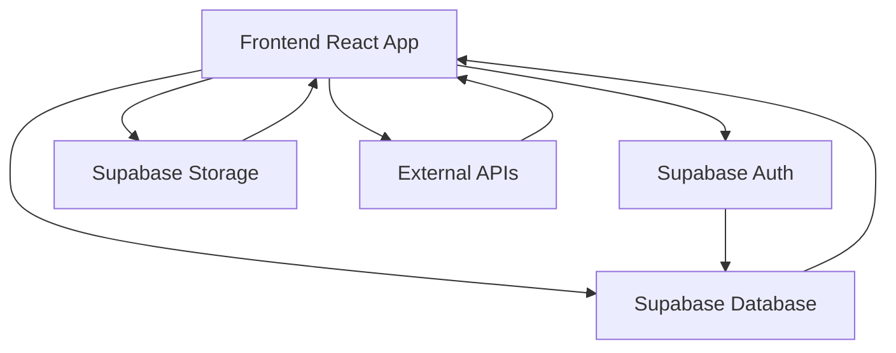
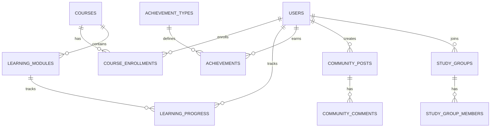

## 1. Architecture Design


## 2. Technology Description
- Frontend: React@18 + TypeScript + Tailwind CSS@3 + Vite
- Initialization Tool: vite-init
- Backend: Supabase (Authentication, Database, Storage)
- Database: Supabase (PostgreSQL)
- External Services: Speech-to-text API (for speaking practice), Translation API (for language support)

## 3. Route Definitions
| Route | Purpose |
|-------|---------|
| / | Home page with course recommendations and progress overview |
| /courses | Course listing page with language and level filters |
| /courses/:id | Course details page with interactive learning modules |
| /profile | User profile with learning statistics and achievements |
| /community | Community page with discussion forums and study groups |
| /login | User login page |
| /register | User registration page |
| /settings | Account settings page |

## 4. API Definitions
### Supabase Client SDK Usage
- Authentication: `supabase.auth` for user registration, login, and session management
- Database: `supabase.from()` for CRUD operations on tables
- Storage: `supabase.storage` for storing user uploads and course materials

## 5. Server Architecture Diagram
Not applicable - using Supabase as backend service

## 6. Data Model
### 6.1 Data Model Definition


### 6.2 Data Definition Language
```sql
-- Users table (managed by Supabase Auth)
-- Note: Supabase automatically creates auth.users table

-- Extended user profile table
CREATE TABLE public.profiles (
  id UUID REFERENCES auth.users(id) PRIMARY KEY,
  username TEXT UNIQUE NOT NULL,
  full_name TEXT,
  avatar_url TEXT,
  bio TEXT,
  preferred_languages TEXT[],
  proficiency_levels JSONB,
  created_at TIMESTAMP WITH TIME ZONE DEFAULT NOW()
);

-- Courses table
CREATE TABLE public.courses (
  id UUID PRIMARY KEY DEFAULT gen_random_uuid(),
  title TEXT NOT NULL,
  description TEXT,
  language TEXT NOT NULL,
  level TEXT NOT NULL,
  duration INTEGER,
  price DECIMAL(10,2),
  is_premium BOOLEAN DEFAULT false,
  image_url TEXT,
  created_at TIMESTAMP WITH TIME ZONE DEFAULT NOW()
);

-- Learning modules table
CREATE TABLE public.learning_modules (
  id UUID PRIMARY KEY DEFAULT gen_random_uuid(),
  course_id UUID REFERENCES public.courses(id),
  title TEXT NOT NULL,
  type TEXT NOT NULL, -- vocabulary, grammar, speaking, listening
  content JSONB NOT NULL,
  order_index INTEGER NOT NULL,
  created_at TIMESTAMP WITH TIME ZONE DEFAULT NOW()
);

-- Course enrollments table
CREATE TABLE public.course_enrollments (
  id UUID PRIMARY KEY DEFAULT gen_random_uuid(),
  user_id UUID REFERENCES auth.users(id),
  course_id UUID REFERENCES public.courses(id),
  enrolled_at TIMESTAMP WITH TIME ZONE DEFAULT NOW(),
  progress DECIMAL(5,2) DEFAULT 0
);

-- Learning progress table
CREATE TABLE public.learning_progress (
  id UUID PRIMARY KEY DEFAULT gen_random_uuid(),
  user_id UUID REFERENCES auth.users(id),
  module_id UUID REFERENCES public.learning_modules(id),
  completed BOOLEAN DEFAULT false,
  score INTEGER,
  last_accessed TIMESTAMP WITH TIME ZONE DEFAULT NOW()
);

-- Achievement types table
CREATE TABLE public.achievement_types (
  id UUID PRIMARY KEY DEFAULT gen_random_uuid(),
  name TEXT NOT NULL,
  description TEXT,
  icon_url TEXT,
  rarity TEXT
);

-- Achievements table
CREATE TABLE public.achievements (
  id UUID PRIMARY KEY DEFAULT gen_random_uuid(),
  user_id UUID REFERENCES auth.users(id),
  achievement_type_id UUID REFERENCES public.achievement_types(id),
  earned_at TIMESTAMP WITH TIME ZONE DEFAULT NOW()
);

-- Community posts table
CREATE TABLE public.community_posts (
  id UUID PRIMARY KEY DEFAULT gen_random_uuid(),
  user_id UUID REFERENCES auth.users(id),
  title TEXT NOT NULL,
  content TEXT NOT NULL,
  language TEXT,
  category TEXT,
  created_at TIMESTAMP WITH TIME ZONE DEFAULT NOW(),
  likes INTEGER DEFAULT 0
);

-- Community comments table
CREATE TABLE public.community_comments (
  id UUID PRIMARY KEY DEFAULT gen_random_uuid(),
  post_id UUID REFERENCES public.community_posts(id),
  user_id UUID REFERENCES auth.users(id),
  content TEXT NOT NULL,
  created_at TIMESTAMP WITH TIME ZONE DEFAULT NOW()
);

-- Study groups table
CREATE TABLE public.study_groups (
  id UUID PRIMARY KEY DEFAULT gen_random_uuid(),
  name TEXT NOT NULL,
  description TEXT,
  language TEXT NOT NULL,
  created_by UUID REFERENCES auth.users(id),
  created_at TIMESTAMP WITH TIME ZONE DEFAULT NOW()
);

-- Study group members table
CREATE TABLE public.study_group_members (
  id UUID PRIMARY KEY DEFAULT gen_random_uuid(),
  group_id UUID REFERENCES public.study_groups(id),
  user_id UUID REFERENCES auth.users(id),
  joined_at TIMESTAMP WITH TIME ZONE DEFAULT NOW(),
  role TEXT DEFAULT 'member'
);

-- Initial data for achievement types
INSERT INTO public.achievement_types (name, description, icon_url, rarity)
VALUES 
('First Lesson', 'Complete your first lesson', 'https://example.com/icons/first-lesson.svg', 'common'),
('Language Learner', 'Learn 100 words', 'https://example.com/icons/language-learner.svg', 'common'),
('Grammar Master', 'Complete 5 grammar exercises', 'https://example.com/icons/grammar-master.svg', 'uncommon'),
('Speaking Pro', 'Complete 10 speaking practice sessions', 'https://example.com/icons/speaking-pro.svg', 'uncommon'),
('Loyal Learner', 'Study for 7 days in a row', 'https://example.com/icons/loyal-learner.svg', 'rare'),
('Polyglot', 'Learn 3 different languages', 'https://example.com/icons/polyglot.svg', 'epic');

-- Initial data for sample courses
INSERT INTO public.courses (title, description, language, level, duration, price, is_premium, image_url)
VALUES 
('English for Beginners', 'Start your English learning journey with basic vocabulary and grammar', 'English', 'Beginner', 40, 0, false, 'https://example.com/images/english-beginner.jpg'),
('Japanese Foundations', 'Learn essential Japanese phrases and characters', 'Japanese', 'Beginner', 45, 0, false, 'https://example.com/images/japanese-foundations.jpg'),
('Korean Basics', 'Master the Korean alphabet and basic conversation', 'Korean', 'Beginner', 40, 0, false, 'https://example.com/images/korean-basics.jpg'),
('English Intermediate', 'Improve your English with more complex grammar and vocabulary', 'English', 'Intermediate', 60, 99.99, true, 'https://example.com/images/english-intermediate.jpg'),
('Japanese Intermediate', 'Enhance your Japanese with intermediate grammar and kanji', 'Japanese', 'Intermediate', 65, 99.99, true, 'https://example.com/images/japanese-intermediate.jpg');

-- Grant permissions
GRANT SELECT ON public.profiles, public.courses, public.learning_modules, public.achievement_types, public.community_posts TO anon;
GRANT ALL PRIVILEGES ON public.profiles, public.course_enrollments, public.learning_progress, public.achievements, public.community_posts, public.community_comments, public.study_groups, public.study_group_members TO authenticated;
```